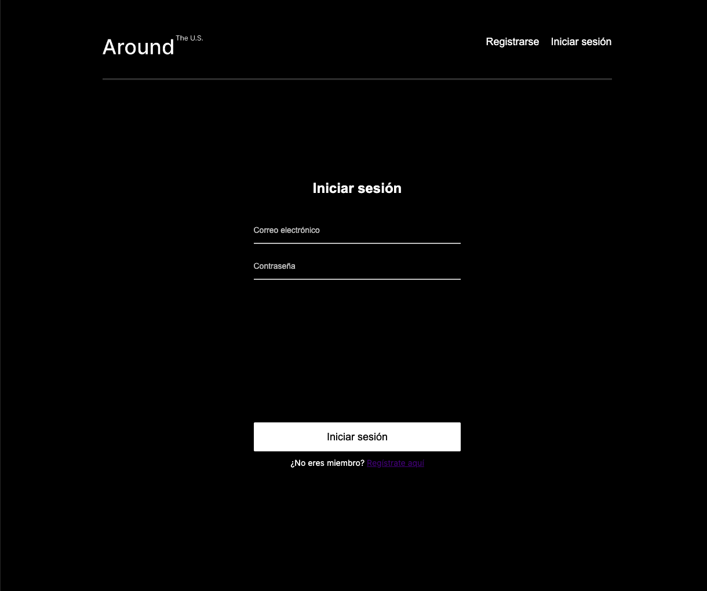

# Around the US - Auth 🌎


## 📋 Descripción del Proyecto


Aplicación front-end construida con React + Vite pensada alrededor de un flujo de autenticación (registro, login, verificación de token) y gestión de "cards".

Este repositorio contiene una UI que consume una API externa (servicios TripleTen). El proyecto ya incluye utilidades para autenticación (`src/utils/auth.js`) y llamadas al backend (`src/utils/Api.js`).

Estado: plantilla / proyecto educativo con integración de autenticación y CRUD básico de tarjetas.

Homepage / Demo (si aplica): https://luuzuriaga.github.io/web_project_around_react/

## Tecnologías

- React 19
- Vite
- React Router
- ESLint
- GitHub Pages (script de despliegue)

## Estructura principal del proyecto

- `src/` - código fuente React
  - `components/` - componentes de UI organizados por funcionalidad (App, Header, Footer, Main, Login, Register, Popups, etc.)
  - `contexts/` - `CurrentUserContext` para compartir información del usuario
  - `utils/` - utilidades: `Api.js` (consumo de REST API) y `auth.js` (registro/login/checkToken)
  - `assets/`, `styles` y demás recursos
- `blocks/`, `images/`, `vendor/` - estilos y recursos estáticos
- `index.html`, `vite.config.js`, `package.json` - configuración y scripts

## Características principales

- Registro e inicio de sesión usando la API de TripleTen.
- Verificación de token en el arranque de la app.
- CRUD básico de "cards": lectura, creación, like/unlike y eliminación.
- Gestión de avatar y perfil.

## Cómo ejecutar (desarrollo)

Requisitos:

- Node.js (recomendado >= 16)
- npm o pnpm (las instrucciones usan npm)

Instalación:

```bash
npm install
```

Iniciar en modo desarrollo (Vite con HMR):

```bash
npm run dev
```

Build para producción:

```bash
npm run build
```

Preview del build localmente:

```bash
npm run preview
```

Despliegue (usa `gh-pages` y el script `deploy`):

```bash
npm run deploy
```

## Scripts útiles (definidos en `package.json`)

- `npm run dev` — inicia Vite en modo desarrollo.
- `npm run build` — genera los assets de producción en `dist/`.
- `npm run preview` — preview local del build.
- `npm run lint` — ejecuta ESLint sobre el proyecto.
- `npm run deploy` — despliega `dist/` a GitHub Pages (usa `gh-pages`).

## Configuración de la API y autenticación

Los archivos principales que controlan la comunicación con el backend son:

- `src/utils/Api.js` — instancia de `Api` con métodos para: obtener info de usuario, tarjetas iniciales, crear tarjetas, like/unlike, eliminar tarjeta y actualizar avatar.
  - En este archivo hay un `baseUrl` por defecto: `https://around-api.es.tripleten-services.com/v1`.
  - `Api` expone `setToken(token)` y `removeToken()` para inyectar/remover el header `Authorization: Bearer <token>` en las peticiones.

- `src/utils/auth.js` — clase `Auth` que maneja `register`, `login` y `checkToken`.
  - `auth` está configurado por defecto con `https://se-register-api.en.tripleten-services.com/v1`.

Flujo de autenticación en la app (resumen):

1. Registro: `auth.register(email, password)` -> la API puede devolver `{ data: { email, _id } }`.
2. Login: `auth.login(email, password)` -> la API suele devolver `{ token }`. Si retorna `token`, la app:
   - Guarda el token en `localStorage` (clave `token`).
   - Llama a `api.setToken(token)` para incluir el header en futuras peticiones.
   - Carga datos iniciales (`api.getUserInformation()` y `api.getInitialCards()`).
3. En el arranque, la app chequea `localStorage.getItem('token')`. Si existe, llama `auth.checkToken(token)` para validar y, si es válido, establece el usuario y llama a `api.setToken(token)`.
4. Logout: elimina `token` de `localStorage` y llama `api.removeToken()`.

Dónde cambiar los endpoints:

- Puedes editar directamente `src/utils/Api.js` y `src/utils/auth.js` para apuntar a otros endpoints o para inyectar valores desde variables de entorno (recomendado para entornos de staging/producción).

Ejemplo (sugerencia rápida): usar variables de entorno Vite en vez de valores hardcodeados:

1. Crear `.env.local` con:

```
VITE_API_BASE_URL=https://mi-api.example.com/v1
VITE_AUTH_BASE_URL=https://mi-auth.example.com/v1
```

2. Modificar `src/utils/Api.js` y `src/utils/auth.js` para usar `import.meta.env.VITE_API_BASE_URL` y `import.meta.env.VITE_AUTH_BASE_URL` respectivamente.

## Seguridad y notas

- En desarrollo el token se guarda en `localStorage` (fácil para prototipos). Para producción, considera mecanismos más seguros (httpOnly cookies, SameSite, refresh tokens, CSRF protections).
- No expongas tokens ni secretos en el repositorio.

## Pruebas

No hay tests automáticos incluidos en este repositorio por defecto. Se recomienda añadir tests unitarios con Jest/React Testing Library y pruebas e2e con Playwright o Cypress si se requiere.

## Contribuir

1. Haz fork del repositorio.
2. Crea una rama feature: `git checkout -b feature/mis-cambios`.
3. Realiza tus cambios y commitea con mensajes claros.
4. Abre un pull request hacia `main`.

Por favor, sigue las convenciones del proyecto (ESLint) y mantén cambios pequeños y revisables.

## Contacto y referencia

- Autor: luuzuriaga
- Repo: web_project_around_auth



## Licencia


[](https://opensource.org/licenses/MIT)
[](https://nodejs.org/)
[](https://reactjs.org/)


